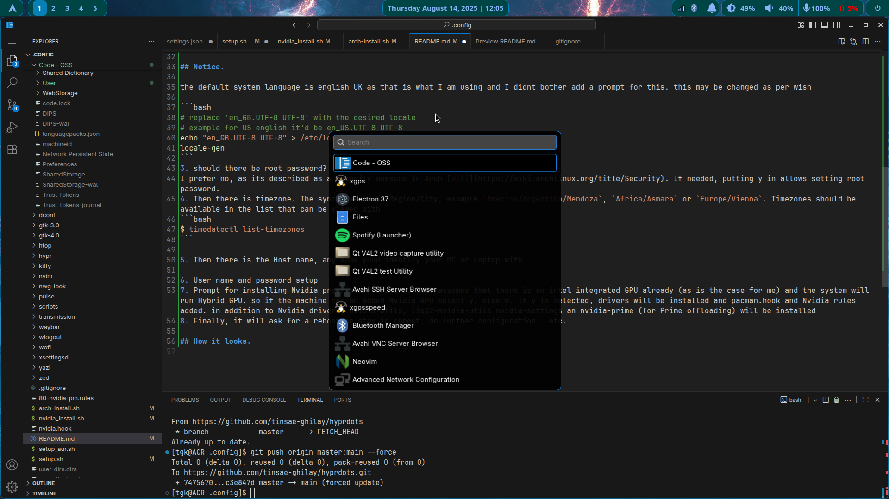

## My Set up
Here are my hyprland + waybar config files.

I start by partitioning, formatting disks mounting them, enabling multilib on live iso and connecting to internet, after that
i curl the starting script with 

```bash

curl https://raw.githubusercontent.com/tinsae-ghilay/hyprdots/refs/heads/master/arch-install.sh -o installscript.sh

```
The above info is for me. If by any chance some one finds this and wants to use it for a fast install of their system, the prompts are straight forward.

1. Just asking if the script should be run. if multilib is not enabled it will fail after a bit. so uncomment multilib in `/etc/pacman.conf` (you may probably know this but "using vim or nano")

2. will ask for a keyboard layout, this layout should be available in the list of available input layouts. this can be obtained using the command `localectl list-keymaps`. for example this lists the following for German 
```bash
$ localectl list-keymaps

de   # this is generay quertz keyboard
de-latin1 # German with dead keys
de-latin1-nodeadkeys # german with no deadkeys -> what I want
de-mobii
de_CH-latin1 # swiss german
de_alt_UTF-8
``` 

so when it asks for keymap i type `de-latin1-nodeadkeys`

> ## *WARNING!!!* 
> for now if this is given a wring value, script will fail. so input carefully

## Notice.

the default system language is english UK as that is what I am using and I didnt bother add a prompt for this. this may be changed as per wish

```bash
# replace 'en_GB.UTF-8 UTF-8' with the desired locale 
# example for US english it'd be en_US.UTF-8 UTF-8
echo "en_GB.UTF-8 UTF-8" > /etc/locale.gen 
locale-gen
```
3. should there be root password?
I prefer no, as its described as a security measure in Arch [wiki](https://wiki.archlinux.org/title/Security). If needed, putting y in allows setting root password.
4. Then there is timezone. The syntax would be Region/City, example `America/Argentina/Mendoza`, `Africa/Asmara` or `Europe/Vienna`. Timezones should be available in the list that can be viewed with 
```bash
$ timedatectl list-timezones
```

5. Then there is the Host name, any name youd identify your PC or Laptop with

6. User name and password setup
7. Prompt for installing Nvidia proprietary drivers. This assumes that there is an intel integrated GPU already (as is the case for me) and the system will run Hybrid GPU. so if the machine has an added Nvidia GPU select y, else n. if y is selected, drivers will be installed and pacman.hook and Nvidia rules added. in addition to Nvidia drivers, nvidia-utils, lib32-nvidia-utils nvidia-settings an nvidia-prime (for Prime offloading) will be installed
8. Finally, it will ask for a reboot or stay in chroot, do further configuration ..etc. 

## How it looks

Code -Oss, wofi and waybar open


wallpaper and waybar


## installed packages

The following Packages and their dependencis are installed by the script

#### Pacstraped
``` bash
    base base-devel linux linux-firmware intel-ucode sof-firmware \
    mesa lib32-mesa  lib32-vulkan-intel vulkan-intel intel-media-driver \
    networkmanager nm-connection-editor network-manager-applet \
    sudo dosfstools \
    man-db man-pages texinfo \
    neovim nano git gcc gdb efibootmgr
```

#### In chroot
The following commands are run in chroot to install packages

```bash
# Install Hyprland and all other packages ---
echo "Installing Hyprland and all specified packages..."

# hyprecosystem
pacman -S --needed --noconfirm hyprland hypridle hyprlock hyprpaper hyprshot hyprpolkitagent hyprsunset && echo "--- DONE ---"

# xdg desktop portal
pacman -S --needed --noconfirm xdg-desktop-portal-hyprland xdg-desktop-portal-gtk && echo "--- DONE ---"

# qt wayland support + wlogout dependencies
pacman -S --needed --noconfirm qt5-wayland qt6-wayland meson scdoc && echo "--- DONE ---"

# audio
pacman -S --needed --noconfirm pipewire wireplumber pipewire-pulse pipewire-alsa pipewire-jack && echo "--- DONE ---"

# msic needed
pacman -S --needed --noconfirm swaync kitty wofi firefox code spotify-launcher waybar wl-clip-persist && echo "--- DONE ---"

# print bluetooth and brightness services
pacman -S --needed --noconfirm brightnessctl cups cups-filters gutenprint bluez bluez-utils blueman bluez-cups && echo "--- DONE ---"

# gnome apps
pacman -S --needed --noconfirm loupe gnome-text-editor nautilus nwg-look gnome-keyring evince polkit-gnome && echo "--- DONE ---"

# android and ntfs support
pacman -S --needed --noconfirm ntfs-3g android-udev gvfs scrcpy && echo "--- DONE ---"

# fonts
pacman -S --needed --noconfirm ttf-dejavu noto-fonts noto-fonts-cjk noto-fonts-emoji ttf-liberation ttf-roboto cantarell-fonts ttf-fira-code ttf-hack ttf-jetbrains-mono-nerd adobe-source-code-pro-fonts && echo "--- DONE ---"

# X11 support
pacman -S --needed --noconfirm xorg-xwayland && echo "--- DONE ---"

# I found ly to be straight forward and enough
pacman -S --needed --noconfirm ly && echo "--- DONE ---"
```

#### After Install

`Wlogout` is only found in Aur, So It has to be manully installed
the following can be used

```bash
# change dir to Downloads
cd Downloads
# clone wlogout from Aur and change directory to wlogout
git clone https://aur.archlinux.org/wlogout.git && cd wlogout
# Download signature
curl 'https://keyserver.ubuntu.com/pks/lookup?op=get&search=0xf4fdb18a9937358364b276e9e25d679af73c6d2f' -o key.asc
# import signature
gpg --import key.asc

# Build and install
makepkg -si # --noconfirm can be added if needed
```

### Display manager
[Ly](https://github.com/fairyglade/ly) is installed for login and [Hyprlock](https://wiki.hypr.land/Hypr-Ecosystem/hyprlock/) for locking session
and Ly will need to be configured manualy if needed. Hyprlock's config files are in the dotfiles, so it comes configured


## Shortcuts

The following shortcuts (Key binds are in hyprland's config file). ***NOTE:*** Not all are fully configured, For example, Playercontrol isnt set up because I use my phone for music

# Keybindings for Hyprland

## General Keybindings

| **Keybinding**                        | **Action**                             |
|---------------------------------------|----------------------------------------|
| ` + Q`                        | Open terminal                          |
| `$mainMod + C`                        | Kill active window                     |
| `$mainMod + M`                        | Exit session                           |
| `$mainMod + E`                        | Open file manager                      |
| `$mainMod + V`                        | Toggle floating window                 |
| `$mainMod + R`                        | Open application menu                  |
| `$mainMod + J`                        | Open Joplin                            |
| `$mainMod + P`                        | Activate dwindle                       |
| `$mainMod + Tab`                      | Toggle split layout                    |
| `ALT + Tab`                           | Cycle through windows                  |
| `$mainMod + F`                        | Open web browser                       |
| `$mainMod + X`                        | Logout                                 |

## Window Management

| **Keybinding**                        | **Action**                             |
|---------------------------------------|----------------------------------------|
| `$mainMod + Left Arrow`               | Move focus left                        |
| `$mainMod + Right Arrow`              | Move focus right                       |
| `$mainMod + Up Arrow`                 | Move focus up                          |
| `$mainMod + Down Arrow`               | Move focus down                        |
| `$mainMod + Space`                    | Toggle Waybar                          |
| `$mainMod + Shift + Left Arrow`       | Move window left                       |
| `$mainMod + Shift + Right Arrow`      | Move window right                      |
| `$mainMod + Shift + Up Arrow`         | Move window up                         |
| `$mainMod + Shift + Down Arrow`       | Move window down                       |
| `$mainMod + Alt + Left Arrow`         | Resize active window (left)            |
| `$mainMod + Alt + Up Arrow`           | Resize active window (up)              |
| `$mainMod + Alt + Down Arrow`         | Resize active window (down)            |
| `$mainMod + Alt + Right Arrow`        | Resize active window (right)           |

## Workspace Management

| **Keybinding**                        | **Action**                             |
|---------------------------------------|----------------------------------------|
| `$mainMod + 1`                        | Switch to workspace 1                  |
| `$mainMod + 2`                        | Switch to workspace 2                  |
| `$mainMod + 3`                        | Switch to workspace 3                  |
| `$mainMod + 4`                        | Switch to workspace 4                  |
| `$mainMod + 5`                        | Switch to workspace 5                  |
| `$mainMod + 6`                        | Switch to workspace 6                  |
| `$mainMod + 7`                        | Switch to workspace 7                  |
| `$mainMod + 8`                        | Switch to workspace 8                  |
| `$mainMod + 9`                        | Switch to workspace 9                  |
| `$mainMod + 0`                        | Switch to workspace 10                 |
| `$mainMod + Shift + 1`                | Move window to workspace 1             |
| `$mainMod + Shift + 2`                | Move window to workspace 2             |
| `$mainMod + Shift + 3`                | Move window to workspace 3             |
| `$mainMod + Shift + 4`                | Move window to workspace 4             |
| `$mainMod + Shift + 5`                | Move window to workspace 5             |
| `$mainMod + Shift + 6`                | Move window to workspace 6             |
| `$mainMod + Shift + 7`                | Move window to workspace 7             |
| `$mainMod + Shift + 8`                | Move window to workspace 8             |
| `$mainMod + Shift + 9`                | Move window to workspace 9             |
| `$mainMod + Shift + 0`                | Move window to workspace 10            |

## Special Workspaces

| **Keybinding**                        | **Action**                             |
|---------------------------------------|----------------------------------------|
| `$mainMod + S`                        | Toggle special workspace "magic"       |
| `$mainMod + Shift + S`                | Move window to special workspace "magic" |

## Mouse Actions

| **Keybinding**                        | **Action**                             |
|---------------------------------------|----------------------------------------|
| `$mainMod + mouse_down`               | Scroll to next workspace               |
| `$mainMod + mouse_up`                 | Scroll to previous workspace           |
| `$mainMod + mouse:272`                | Move window with mouse                 |
| `$mainMod + mouse:273`                | Resize window with mouse               |

## Multimedia and Audio Control

| **Keybinding**                        | **Action**                             |
|---------------------------------------|----------------------------------------|
| `XF86AudioRaiseVolume`                | Raise volume                           |
| `XF86AudioLowerVolume`                | Lower volume                           |
| `XF86AudioMute`                       | Mute/unmute audio                      |
| `XF86AudioMicMute`                    | Mute/unmute microphone                 |
| `XF86MonBrightnessUp`                 | Increase screen brightness             |
| `XF86MonBrightnessDown`               | Decrease screen brightness             |
| `XF86AudioNext`                       | Next track (playerctl)                 |
| `XF86AudioPause`                      | Pause/play track (playerctl)           |
| `XF86AudioPlay`                       | Pause/play track (playerctl)           |
| `XF86AudioPrev`                       | Previous track (playerctl)             |

## Screenshots

| **Keybinding**                        | **Action**                             |
|---------------------------------------|----------------------------------------|
| `$mainMod + PRINT`                    | Screenshot window                      |
| `PRINT`                               | Screenshot monitor                     |
| `$shiftMod + PRINT`                   | Screenshot region                      |

## Custom Commands

| **Keybinding**                        | **Action**                             |
|---------------------------------------|----------------------------------------|
| `$mainMod + E`                        | Open file manager                      |
| `$mainMod + R`                        | Open application menu                  |
| `$mainMod + F`                        | Open web browser                       |
| `$mainMod + X`                        | Logout                                 |


<h2>Keybindings for Hyprland</h2>

<h3>General Keybindings</h3>
<table align="center">
  <thead>
    <tr>
      <th>Keybinding</th>
      <th>Action</th>
    </tr>
  </thead>
  <tbody>
    <tr><td>$mainMod + Q</td><td>Open terminal</td></tr>
    <tr><td>$mainMod + C</td><td>Kill active window</td></tr>
    <tr><td>$mainMod + M</td><td>Exit session</td></tr>
    <tr><td>$mainMod + E</td><td>Open file manager</td></tr>
    <tr><td>$mainMod + V</td><td>Toggle floating window</td></tr>
    <tr><td>$mainMod + R</td><td>Open application menu</td></tr>
    <tr><td>$mainMod + J</td><td>Open Joplin</td></tr>
    <tr><td>$mainMod + P</td><td>Activate dwindle</td></tr>
    <tr><td>$mainMod + Tab</td><td>Toggle split layout</td></tr>
    <tr><td>ALT + Tab</td><td>Cycle through windows</td></tr>
    <tr><td>$mainMod + F</td><td>Open web browser</td></tr>
    <tr><td>$mainMod + X</td><td>Logout</td></tr>
  </tbody>
</table>

<h3>Window Management</h3>
<table align="center">
  <thead>
    <tr>
      <th>Keybinding</th>
      <th>Action</th>
    </tr>
  </thead>
  <tbody>
    <tr><td>$mainMod + Left Arrow</td><td>Move focus left</td></tr>
    <tr><td>$mainMod + Right Arrow</td><td>Move focus right</td></tr>
    <tr><td>$mainMod + Up Arrow</td><td>Move focus up</td></tr>
    <tr><td>$mainMod + Down Arrow</td><td>Move focus down</td></tr>
    <tr><td>$mainMod + Space</td><td>Toggle Waybar</td></tr>
    <tr><td>$mainMod + Shift + Left Arrow</td><td>Move window left</td></tr>
    <tr><td>$mainMod + Shift + Right Arrow</td><td>Move window right</td></tr>
    <tr><td>$mainMod + Shift + Up Arrow</td><td>Move window up</td></tr>
    <tr><td>$mainMod + Shift + Down Arrow</td><td>Move window down</td></tr>
    <tr><td>$mainMod + Alt + Left Arrow</td><td>Resize active window (left)</td></tr>
    <tr><td>$mainMod + Alt + Up Arrow</td><td>Resize active window (up)</td></tr>
    <tr><td>$mainMod + Alt + Down Arrow</td><td>Resize active window (down)</td></tr>
    <tr><td>$mainMod + Alt + Right Arrow</td><td>Resize active window (right)</td></tr>
  </tbody>
</table>

<h3>Workspace Management</h3>
<table align="center">
  <thead>
    <tr>
      <th>Keybinding</th>
      <th>Action</th>
    </tr>
  </thead>
  <tbody>
    <tr><td>$mainMod + 1</td><td>Switch to workspace 1</td></tr>
    <tr><td>$mainMod + 2</td><td>Switch to workspace 2</td></tr>
    <tr><td>$mainMod + 3</td><td>Switch to workspace 3</td></tr>
    <tr><td>$mainMod + 4</td><td>Switch to workspace 4</td></tr>
    <tr><td>$mainMod + 5</td><td>Switch to workspace 5</td></tr>
    <tr><td>$mainMod + 6</td><td>Switch to workspace 6</td></tr>
    <tr><td>$mainMod + 7</td><td>Switch to workspace 7</td></tr>
    <tr><td>$mainMod + 8</td><td>Switch to workspace 8</td></tr>
    <tr><td>$mainMod + 9</td><td>Switch to workspace 9</td></tr>
    <tr><td>$mainMod + 0</td><td>Switch to workspace 10</td></tr>
    <tr><td>$mainMod + Shift + 1</td><td>Move window to workspace 1</td></tr>
    <tr><td>$mainMod + Shift + 2</td><td>Move window to workspace 2</td></tr>
    <tr><td>$mainMod + Shift + 3</td><td>Move window to workspace 3</td></tr>
    <tr><td>$mainMod + Shift + 4</td><td>Move window to workspace 4</td></tr>
    <tr><td>$mainMod + Shift + 5</td><td>Move window to workspace 5</td></tr>
    <tr><td>$mainMod + Shift + 6</td><td>Move window to workspace 6</td></tr>
    <tr><td>$mainMod + Shift + 7</td><td>Move window to workspace 7</td></tr>
    <tr><td>$mainMod + Shift + 8</td><td>Move window to workspace 8</td></tr>
    <tr><td>$mainMod + Shift + 9</td><td>Move window to workspace 9</td></tr>
    <tr><td>$mainMod + Shift + 0</td><td>Move window to workspace 10</td></tr>
  </tbody>
</table>

<h3>Special Workspaces</h3>
<table align="center">
  <thead>
    <tr>
      <th>Keybinding</th>
      <th>Action</th>
    </tr>
  </thead>
  <tbody>
    <tr><td>$mainMod + S</td><td>Toggle special workspace "magic"</td></tr>
    <tr><td>$mainMod + Shift + S</td><td>Move window to special workspace "magic"</td></tr>
  </tbody>
</table>

<h3>Mouse Actions</h3>
<table align="center">
  <thead>
    <tr>
      <th>Keybinding</th>
      <th>Action</th>
    </tr>
  </thead>
  <tbody>
    <tr><td>$mainMod + mouse_down</td><td>Scroll to next workspace</td></tr>
    <tr><td>$mainMod + mouse_up</td><td>Scroll to previous workspace</td></tr>
    <tr><td>$mainMod + mouse:272</td><td>Move window with mouse</td></tr>
    <tr><td>$mainMod + mouse:273</td><td>Resize window with mouse</td></tr>
  </tbody>
</table>

<h3>Multimedia and Audio Control</h3>
<table align="center">
  <thead>
    <tr>
      <th>Keybinding</th>
      <th>Action</th>
    </tr>
  </thead>
  <tbody>
    <tr><td>XF86AudioRaiseVolume</td><td>Raise volume</td></tr>
    <tr><td>XF86AudioLowerVolume</td><td>Lower volume</td></tr>
    <tr><td>XF86AudioMute</td><td>Mute/unmute audio</td></tr>
    <tr><td>XF86AudioMicMute</td><td>Mute/unmute microphone</td></tr>
    <tr><td>XF86MonBrightnessUp</td><td>Increase screen brightness</td></tr>
    <tr><td>XF86MonBrightnessDown</td><td>Decrease screen brightness</td></tr>
    <tr><td>XF86AudioNext</td><td>Next track (playerctl)</td></tr>
    <tr><td>XF86AudioPause</td><td>Pause/play track (playerctl)</td></tr>
    <tr><td>XF86AudioPlay</td><td>Pause/play track (playerctl)</td></tr>
    <tr><td>XF86AudioPrev</td><td>Previous track (playerctl)</td></tr>
  </tbody>
</table>

<h3>Screenshots</h3>
<table align="center">
  <thead>
    <tr>
      <th>Keybinding</th>
      <th>Action</th>
    </tr>
  </thead>
  <tbody>
    <tr><td>$mainMod + PRINT</td><td
